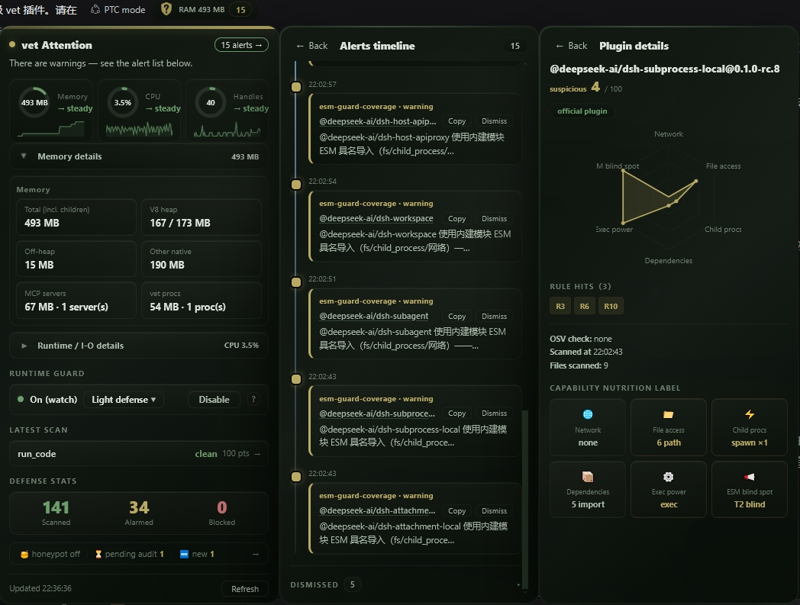

# @jieai/dsh-plugin-vet — DSH 插件安全闸门（装前审核 · 运行守护 · 供应链检查）

[English](README.md) | 中文

[](https://www.npmjs.com/package/@jieai/dsh-plugin-vet)
[](LICENSE)
[](package.json)
[](https://www.dsh.so/artifact/dsh-plugin-vet/)

[🔗 dsh.so 插件提交与安全报告页的扫描由 vet 主导 — 查看](https://www.dsh.so/zh/security-report/)

> **装前审核，运行守护。** 安装任何插件前，先让 dsh-plugin-vet 走一遍：静态规则给出 verdict（确定性、不可伪造），
> agent 按 vet-audit-protocol 技能排查敏感点与质量问题（谁也无法替代），最终一张评分卡交给人/模型决定。
>
> **定位：监控报警器，不是打手。** vet 只做「检查 → 报警 → 给建议」：写时查（静态扫描）、
> 跑时盯（运行时守卫）、报警面（评分卡 + GUI 盾牌状态灯）。**默认配置下 vet 永不替用户动手**——
> 不自动卸载、不自动杀进程、不自动改配置、不拦任何操作。拦截只存在于显式、已文档化的范围：
> **N7 确认拦截**随运行时守卫一起醒来（`confirmBlock`——凭据文件删除/覆盖与确认后破坏性操作在
> `runtimeGuard: watch` 开启时抛错拦截，含 `hardened` 档或盾牌开关开启的情形），以及 **`deny` 模式 /
> `paranoid` 档**（回滚插件加载 + 按阈值拦截）。每一处拦截面都可见、已文档化，均不构成默认产品身份。
> 最终怎么处置，由用户在自己的 DSH 上操作决定。

@jieai/dsh-plugin-vet 是 deepseek-harness 生态的**信任层插件**：占据
**下载 → 扫描 → 审计 → 评分 → 决定 → 运行时盯梢** 这一整套信任流水线。运行时盯梢内置**蜜罐诱饵**：谁偷偷翻找密钥文件，当场现形（opt-in，`honeypot.enabled`）。**不做**插件市场本体（目录/分发）。

## 界面截图




- 📚 架构设计：[docs/ARCHITECTURE.md](docs/ARCHITECTURE.md)
- 🧾 审查协议：[AUDIT_PROTOCOL.md](AUDIT_PROTOCOL.md)
- 🛡️ 安全政策：[SECURITY.md](SECURITY.md)
- 🤝 贡献指南：[CONTRIBUTING.md](CONTRIBUTING.md)

---

## 安装

```sh
dsh plugin --profile <profile> add @jieai/dsh-plugin-vet
```

安装即生效链路：pnpm 安装 → 登记 `dsh.profile.bundles`（或 patch `- insert:` 挂载行）→ 下次启动
boot 组合 bundles 层挂载插件。默认配置见下方 Config（默认 fail-open：只报告、不拦任何操作——
拦截需显式配置，见 confirmBlock / mode / 安全档位）。

**本地 tarball 安装**（离线/先验证再发版场景）：

```sh
dsh plugin --profile <profile> add ./jieai-dsh-plugin-vet-<version>.tgz
# 或直接解包到 profile 的 node_modules：
# tar -xzf jieai-dsh-plugin-vet-<version>.tgz -C ~/.dsh/profiles/<profile>/node_modules/@jieai/
// 并在 profile 的 cordis.patch.yml 里 insert 挂载条目：
//   - insert:
//       - id: plugin-vet
//         name: '@jieai/dsh-plugin-vet'
//         config:
//           mode: report
//           autoScan: true
```

> 路径/相对路径/URL 均可（`dsh plugin add` 走 pnpm 的 `file:` 协议兜底，本地 tgz 直接解析）。
>
> **首次安装耗时提示**：`dsh plugin add` 首次安装到大型 profile 可能耗时数分钟——
> 期间 pnpm 会做全量依赖解析、更新 500+ 包的 lockfile 并对整棵依赖树做供应链策略校验
> （vet 自身只带 3 个运行时依赖，耗时大头是 profile 已有依赖树的解析/校验，不是 vet）。
> 校验完成后再次安装/更新只需秒级（复用校验结果）。


> **兼容性**：vet 面向 DSH 0.1.0-rc.6+（peer：`@deepseek-ai/cordis ^4.0.1`、dsh-* `^0.1.1-rc.1`；
> round-15 对 npm-public `0.1.1-rc.2` 完成适配，其后对 `0.1.5-rc.1`/`0.1.5-rc.2`/`0.1.7-rc.1` 逐一复验
> ——0.1.7 同步新增 R12 的 `dsh.bundle.patch` 有序数组支持与官方包产物降噪）。0.1.7-rc.1 新增的插件
> peer 兼容性预检接受 vet 的声明范围（预检用 `includePrerelease` 语义，预发布版本参与匹配）。安装时 pnpm 可能提示
> unmet peer dependency——这是预期的：profile 模板 `autoInstallPeers: false`，运行期从 DSH 安装闭包
> （`$DSH_HOME/profiles/node_modules` 回退层）解析，无需也不能在 profile 里另装一份 cordis 全家桶。
>
> **npm-public DSH（0.1.1-rc.2+）**：profile 从自身 `package.json` 的 `dsh.profile.bundles` 加载插件
> （boot 组合 bundles 层 + `cordis.patch.yml` + `$DSH_HOME/cordis.patch.yml`，后两层热重载）。`dsh plugin add`
> 之后还要把包名登记进该 bundle 列表（或用 patch `- insert:` 行挂载），否则装了不挂。vet 配置块同用
> row-id 形态（`- id: plugin-vet / config: …`）。

> **监控范围 = 安装 vet 的 profile。** vet 的守卫是进程内事件（`internal/plugin`）——
> vet 装进哪个 profile，就只守那个 profile 实例加载的插件。多 profile 部署时，
> 每个要守的 profile 都要装一份 vet（`dsh plugin --profile <name> add @jieai/dsh-plugin-vet`），
> 并把 requireAudit 配到对应 profile 的 cordis.patch.yml。

## Config（cordis.yml）

| 键 | 默认 | 说明 |
|---|---|---|
| `profile` | `standard` | 安全档位（0.3）：`standard` = 现状默认（噪声最低）；`hardened` = 唤醒休眠能力（运行时守卫、第三方基线、蜜罐；R17/R18/R19 观测抬黄牌）；`paranoid` = hardened + 最严拦截（`requireAudit`、`denyOn: suspicious`、N7 族 3/4 block）。预设只覆盖仍处默认值的键；显式设置（含面板开关写入 patch）恒优先；verdict 语义永不变——见「安全档位（0.3）」节 |
| `mode` | `report` | `report` 只报告不拦截；`deny` 显式开启拦截 |
| `autoScan` | `true` | 新插件（`internal/plugin`）自动静态扫描 |
| `scannerTimeoutMs` | `15000` | 静态扫描子进程超时 |
| `requireAudit` | `false` | 审计门槛（opt-in，**仅第三方**——官方 `@deepseek-ai/*` 包由内容哈希基线 + 静态扫描把关，不要求人工档案，round-17）：开启后新装第三方插件加载时检查 `~/.dsh/vet/audits/` 健康档案——无档案则 `report` 模式记录黄色 `audit-required` 告警、`deny` 模式拦截。档案由 agent 按 `vet-audit-protocol` 技能审查后手写落盘 |
| `rules` | `{}`（全开） | 规则开关（R1-R20；如 `{"R17": false}` 关 !!js 配置面） |
| `scanSurface` | 全开 | 静态扫描面开关（0.2.6，engine static-v14 起，当前 static-v20）：`configFiles`（cordis.yml/patch 的 !!js 检测，R17）、`instructionFiles`（指令/技能注入观测，R18）；关闭只影响新面，旧扫描面照扫 |
| `observeLoopback` | `true` | 本地 API 回环观测（0.2.6 曾默认关；**0.3 起默认开**——回环 + 控制面路径 + 第三方归因，官方归因豁免，yellow 可忽略）：开启后插件对 127.0.0.1 的请求计入 N3 台账，命中 DSH 控制面路径（/api/、session.*、/plugins/）且归因第三方插件 → yellow `loopback-control`（alarm-only、可忽略）。观测不是修复——RPC 认证需 dsh 侧 |
| `telemetryDiff` | `true` | 遥测配置敏感化（0.2.6）：周期读取 profile 配置 telemetry exporter url/mode 字段哈希，冷启动只记录；主机变化 → yellow（要求重启校验，G-3 形态）。只存哈希，配置内容不进报警/档案 |
| `thirdPartyBaseline` | `false`（hardened/paranoid 档开） | 第三方安装后完整性基线（0.2.6）：非官方包记录首装内容哈希，同版本内容变化 → red（可经 `acknowledgedPackageHashes` 豁免）。定位是变更检测而非信任锚；**不影响静态扫描**（第三方包仍要过 verdict） |
| `denyOn` | `critical` | `mode: deny` 时的拦截阈值 |
| `allowlist` | `[]` | 包名/插件 id 白名单（跳过扫描） |
| `runtimeGuard` | `off` | 运行时守卫（性能/稳定代价 opt-in）：`off` 关；`watch` 启用 T1 哨兵 + T2 钩子（alarm-only）**并唤醒 N7 确认拦截**（`confirmBlock` 默认 `block`，见下——`watch` 一旦开启即生效，含 `hardened`/`paranoid` 档与盾牌开关开启的情形） |
| `runtimeIntervalMs` | `2000` | T1 哨兵 /proc 采样间隔 |
| `runtimeMemLimitMb` | `2048` | T1 内存报警阈值（宿主 VmRSS，超限 → red） |
| `runtimeForkBurstN` | `5` | T1 子进程突增报警阈值（单轮增量，→ red） |
| `runtimeFdLimit` | `512` | T1 文件描述符报警阈值（→ yellow） |
| `runtimeGrowthMb` | `256` | T1 内存持续膨胀报警阈值（**完整窗口**内 RSS 净增长，→ yellow 疑似泄漏；起窗初期的瞬时尖峰不构成窗口级持续膨胀，不会误报） |
| `runtimeGrowthWindowMs` | `600000` | 膨胀检测窗口（默认 10 分钟） |
| `honeypot.enabled` | `false` | 蜜罐诱饵（需 `runtimeGuard: watch`）：往 `honeypot.dir` 放假密钥诱饵，T2 对诱饵路径的触碰（读/写/删）单独报 `honeypot` 类报警。目录/文件名/内容均无蜜罐关键词（反蜜罐），默认位置 `~/.dsh/.local`，诱饵值全是格式正确但无效的假凭据 |
| `honeypot.dir` | `''` | 诱饵目录；空 = `$HOME/.dsh/.local` |
| `osvCheck` | `true` | 扫描 package.json 时向 Google OSV 查询已知漏洞（**仅精确版本**查询：range（*、>=、^、~）与无 version 的主包跳过，P3-1/P3-3——避免陈旧全量历史误报；round-7 起 range 不再剥前缀当下界精确版查询）；核对面 = 插件自身 + 直接依赖（上限 8 个，`@deepseek-ai/*` 官方包跳过，P3-10）；间接传递树超出 OSV v1 范围与扫描预算。默认开启会外发包名到 api.osv.dev，网络失败静默降级。介意隐私可设 false |
| `contentBaseline` | `true` | 官方包内容哈希基线（P-5）：对每个 `@deepseek-ai/*` 包的文件计算 SHA-256 并与基线比对——同名冒名包（file:/tarball 无 registry 校验）哈希不符时按最严格 plugin 判定。首次见到自动落盘并信任；基线按 `name@version` 多版本并存（上限：1000 文件 / 50MB / 10s） |
| `networkEgress` | `true` | 运行时网络出口观测（P1）：包装 http/https/net/http2/tls/dgram/fetch，观测插件发起的出站请求（alarm-only，需 `runtimeGuard: watch`） |
| `transitiveDeps` | `false` | 传递依赖 OSV 核对（P1，opt-in，默认关）：调用**本地已安装**的 upstream-radar CLI（绝不 npx 自动安装）；未安装/超时/输出形状不符 → 静默降级为仅直接依赖。命中以 `OSV-T` medium 呈现 |
| `contract` | `enabled`；目录 `~/.dsh/vet/contracts` | 运行时契约（0.3，M1）：每个插件一份契约文件声明其可接受的运行操作面；vet 把观测到的运行行为与之对账——出面行为记入 info `m1-contract-violation`（按插件+字段聚合），契约被拒每插件记一次（黄），N1 隐藏能力结论会使契约失效（「不信任」，每插件一次黄）。契约仅为记录层：永不拦截或阻止加载。环境变量覆写：`DSH_PLUGIN_VET_CONTRACTS_DIR` |
| `confirmBlock` | `block` | N7 确认拦截（0.1.14，需 `runtimeGuard: watch`）：只拦不可逆破坏。`block`（默认）族 1/2 确认即拦；`alarm` 全族只报警；`off` 关闭。每次拦截抛错并写一条红色 `n7-block` 报警；黑名单为进程内存（重启即清） |
| `confirmBlockFamily3` | `alarm` | N7 族 3 覆写（系统持久化/提权面写入：bashrc/cron/systemd/ld.so.preload/sudoers.d/profile.d/autostart/authorized_keys/hosts/ssl）。显式 `block` 为用户自担风险的选择，默认只报警 |
| `confirmBlockFamily4` | `alarm` | N7 族 4 覆写（供应链/安装态写入：node_modules 包文件、cordis.patch.yml / cordis.yml / plugin.json）。显式 `block` 为用户自担风险的选择，默认只报警 |

`@deepseek-ai/*` 官方包默认豁免（内置信任）。

## 安全档位（0.3）

`profile` 是「预设展开成既有细粒度开关」的部署策略层，不是第二套平行配置体系。三条纪律：

1. **档位永不改变 verdict 语义**——verdict 只由确定性静态层产出（信任边界 1/4）；档位只改观测深度、报警面与拦截范围。
2. **显式优先于预设**——用户显式偏离默认值的键存活；写入 profile `cordis.patch.yml` vet 条目的键（如盾牌的运行时守卫开关）视为显式，预设一律不覆盖。已知边界：插件配置区里*显式设为默认值*的键与未设置不可区分，会被预设覆盖——「显式 off」请走 patch 通道。
3. **误报代价随档位递增**——高档位用噪声换覆盖（见代价列）。

| 档位 | 定位 | 预设展开 | 代价 |
|---|---|---|---|
| `standard`（盾牌显示：**轻度防御**）（默认） | 大众默认，噪声最低 | 无——保持现状默认 | 无运行时防线（仅静态 + telemetryDiff + 官方包基线）；**轻度防御 ⇔ 运行时守卫关闭** |
| `hardened`（盾牌显示：**中级防御**） | 唤醒已写好的能力 | `runtimeGuard: watch`、`thirdPartyBaseline: true`、`honeypot.enabled: true`；R17/R18/R19 的 info 观测以黄牌呈现（alarm-only，verdict 不变） | 热点路径约 10-20% 开销；可忽略黄牌增多 |
| `paranoid`（盾牌显示：**高级防御**） | 高敏环境 | hardened 全部 + `requireAudit: true`、`denyOn: suspicious`、`confirmBlockFamily3/4: block` | 噪声最高；拦截面扩大（确认后拦截持久化/安装态写入） |

`observeLoopback` 对所有档位默认开（0.3）：信号特异性足够（回环 + 控制面路径 + 第三方归因；官方归因豁免），
P15/P16/P17/G-2/G-5 一族在零用户操作下回到报警面。

盾牌面板自带「安全档位」一键切换（经 `/vet/profile` 写 patch，保留其他配置键）与 `?` 帮助面板里的档位说明——
无需手改配置。**0.3.1 联动（守卫 ↔ 档位绑定）**：防御档位与运行时守卫不再是两个
独立旋钮——轻度防御 ⇔ 守卫关闭；中级/高级防御 ⇔ 守卫开启。点「开启守卫」档位自动
升到中级（已设高级不降级），点「关闭守卫」档位回轻度；选档位即时切换守卫
（档位预设其余键随 DSH 配置重载展开——patch 写入会触发 DSH watchUserPatches 热重载）。

## 环境变量

所有 `DSH_PLUGIN_VET_*` 路径均在**模块加载时快照**（vet 先于第三方插件加载——插件之后改 `process.env` 无法重定向 vet 的存储）。请在宿主环境设置（DSH profile / 启动脚本），不要由插件内部设置。

| 变量 | 默认值 | 用途 |
|---|---|---|
| `DSH_PLUGIN_VET_CACHE_DIR` | `<tmpdir>/dsh-plugin-vet-cache` | 静态扫描报告缓存（sha-256 键，0600 文件） |
| `DSH_PLUGIN_VET_BASELINE_DIR` | `~/.dsh/vet` | 内容基线存储（`baseline.json`）+ N6 能力历史（`capabilities.json`）+ 版本快照 |
| `DSH_PLUGIN_VET_ARCHIVE_DIR` | `~/.dsh/vet/audits` | 审计健康档案目录——`requireAudit` 在此查找 `<plugin>-<version>-<ts>.md` |
| `DSH_PLUGIN_VET_FORENSICS_DIR` | `~/.dsh/vet/forensics` | 取证流水根目录（确认恶意后按插件全量记录，目录 0700 / 文件 0600） |
| `DSH_PLUGIN_VET_CONTRACTS_DIR` | `~/.dsh/vet/contracts` | 运行时契约快照（状态契约 + 观测对账） |
| `DSH_PLUGIN_VET_STATS_DIR` | `~/.dsh/vet` | 防御统计（`stats.json`，原子写，0600） |
| `DSH_VET_SIDECAR_PID` | （内部） | T1 哨兵 PID 注册表（跨热重载保留）——**内部使用，请勿设置** |

## 工具

- **`scan_plugin`** — 确定性静态扫描：`target` = `dynamic-code`（源码字符串）/ `package`（包目录）/ `file`（单文件，限绝对路径 + 常规文件——拒绝目录/设备/FIFO/符号链接，防 `/dev/zero` 类无限流打爆扫描子进程）。返回评分卡（verdict + staticScore + findings）。verdict 只由静态规则产出。支持 `scanBasis`：`npm`（默认，registry tarball 真实发布物）/ `git`（仅源码仓，R12 入口/patch 缺失降 info 不误报）。0.1.21 起评分卡能力块含 R16 幽灵/僵尸依赖字段；扫 vet 本体（realpath 判定，非包名）时额外输出 `selfScan` 注解块——本体自扫呈现 Trusted 卡（① token 级能力声明降级 + ② 每版本产物钉扎 `vet-self-pins.json`——round-16 起钉扎范围 = 随包发布产物（lib/** 等），生产安装自扫同样 pinned-match；字节匹配任一已发布 pin 即受信，升级窗口不会「两个 vet 互不认」+ ④ 发布自扫门禁），普通插件路径行为零变化；原始 findings 原样保留可展开（详见 docs/ARCHITECTURE.md §5.12）。
- **`vet_diff`** — 只读、纯本地：输出某包本地记录过的版本历史 + 最近两版的行为差分（N6）。展示 hosts/fsPaths/spawnCmds/imports 的新增|移除与网络/执行能力翻转。不扫描、不联网。
- **`vet_label`** — 只读、纯本地：输出某包的人类可读"能力营养标签"（M2）——访问的文件（标注敏感路径）、引用的网络主机/子进程、第三方依赖（能力未知）、网络/执行能力标志（含 ESM 具名导入盲区标记），以及最近升级差分摘要。数据源 = 同一份本地 N6 能力清单历史；标签反映的是**声明侧**静态能力——运行时观测/休眠能力属运行中的盾牌。不扫描、不联网。
- **`vet-audit-protocol`（技能）** — 审查流程协议（`AUDIT_PROTOCOL.md`）：agent 按预设步骤审查新插件——scan_plugin 静态判据（含 R12 Cordis/DSH 契约）→ 读清单/源码 → 逐条核实发现 → 主动深挖（网络/文件/进程/凭据/库语义）→ **契约与代码质量审计**（4.5 步：入口/Config schema 一致性、错误处理/同步阻塞/资源泄漏/异步正确性等「写得烂」问题——静态干净≠值得装）→ 用系统写入能力手写健康档案到 `~/.dsh/vet/audits/<plugin>-<version>-<ts>.md`。vet 不内置审计工具、不替 agent 调查，只给判据与落盘约定。

## 盾牌面板（0.3 改版）

GUI 按 OBSIDIAN MOSS GOLD 设计稿换肤并重构为**层栈交互**（次级面板一律从主面板右缘并排级联滑出、贴主面板外延与主面板等高，永不叠放——极端窄窗溢出右侧不回退整组左移，Esc 逐层退回）：

| 层 | 面板 | 内容 |
|---|---|---|
| L1 | 主面板 | 环趋势复合卡 ×3（内存/CPU/fd：当前值+方向一卡读全）、折叠式内存/IO 详情、运行时守卫与安全档位、防御统计、审计栏、升级差分/蜜罐告警浮动卡 |
| L2 | 报警时间线 / **最近插件列表** / 审计&蜜罐中心 / 关于 vet | 时间线=rail+状态点+卡片（忽略/恢复/复制）；最近插件=扫描留档走廊（每页 20 条，点「加载更多」翻页，round-21）；审计中心=待审欠账 + 蜜罐触碰监控 |
| L3 | 插件详情（唯一三级） | 六轴能力雷达、规则命中墙、OSV/AI 复核 meta、升级差分、声明面营养标签 |

数据面增量（全部只读、向后兼容）：`GET /vet/status.json` 增 `metricsHistory`（64 点趋势）、`audit`（待审清单/新装/插件索引/蜜罐状态）与 `lastUpgradeDiff`；新增 `GET /vet/plugin?name=` 详情端点；本地新增扫描摘要库 `~/.dsh/vet/scan-summaries.json`（自动扫描与 vet-gate 双路径写入）。诚实口径：雷达/营养标签反映**声明侧**静态能力（同 vet_label）；「已拦截」标记来自 N7 族 1 名单。

## 自动行为

- **`internal/plugin` 自动扫描**（`autoScan: true`）：新装第三方 npm 包加载时自动静态扫描；`deny` 模式 + verdict ≥ `denyOn` → 回滚加载。
- **审计门槛**（`requireAudit: true`）：无健康档案的第三方插件加载时——`report` 模式记录黄色 `audit-required` 告警（进 /vet/status.json 告警列表，插件照常加载）；`deny` 模式回滚加载（引用 `vet-audit-protocol` 提示先审查）。**档案按版本精确匹配**（P-1）：插件升级后旧版本档案不放行新版本——重新审查才能消除告警/拦截。**门槛仅对第三方生效**（round-17）：官方包（`@deepseek-ai/*`）由内容哈希基线 + 静态扫描把关（决策 1：首见/match 照常全扫、只豁免 deny 升级），DSH 自带官方插件不触发 `audit-required`。
- **`tools/execute` 拦截**：`cordis_define` / `run_code` / `workflow` 执行前扫描代码字符串（`cordis_run` 的真实 schema 无 code 载荷——守卫位保持 dormant 作 tripwire：未来 schema 若带 code/source/script 载荷立即进扫描面，当前零误报）；`report` 模式仅在非 clean 结果时加 `VET:` 前缀（干净执行不污染机器可读输出），`deny` 模式直接拦截（isError）。
- **运行时守卫（`runtimeGuard: watch`）**——T1/T2 观测 alarm-only；拦截面在专门的 N7 层（见下「N7 确认拦截」）：
  - **T1 哨兵**：旁路子进程每 `runtimeIntervalMs` 读宿主 /proc（VmRSS / 子进程数 / fd 数），报警 JSON 行回传宿主 → 盾牌变黄/红。
  - **T2 钩子**：进程内包装 fs / child_process（含 fs.promises），危险操作（敏感路径写入/删除、读密钥文件、含 shell/下载外联关键词的子进程、蜜罐诱饵触碰、`~/.dsh` 配置根侦察）取栈归因到插件包名后报警；官方包归因全类降噪（能力授权——官方包是平台本体，高频读写 `~/.dsh` 会话/配置/存储不刷屏；第三方无法伪造归因）。**从不阻断调用**。自伤豁免（实测误报后修复）：
    - **node_modules 包目录豁免**：包名/包内文件是公开工件——含 credential/secret 等词的包名是正常生态（`@aws-sdk/credential-provider-*`、`@deepseek-ai/dsh-credentials-local` 等），宿主模块解析（require.resolve 内部 realpathSync/stat 包内 package.json）与 vet 扫描读取都会高频触碰，不再误报 fs-probe；node_modules 之前的段照常判定（`~/.ssh/node_modules/x` 仍命中 .ssh），写删系统根（/usr 等）仍报警。
    - **归因排除 vet 自身**：包装器帧永远是报警栈栈顶，vet 根不参与归因映射——宿主/无主报警不再栽到 vet 头上（报警照发，归因到真实调用方）。
    - 工具链临时产物（tsc `<源名>.<pid>.<uuid>.tmpdir`、`*.tmp`、`*.temp`、`*.swp` 等）自动豁免——名字里的 secrets/credentials 只是被编译的源文件名，删它是清理不是破坏；父段照常判定（`~/.ssh/config.bak` 仍报警）。
- **GUI 盾牌**：浏览器半区注册进 `conversation.session.header.actions`，轮询 /vet/status.json 显示绿/黄/红灯 + 报警计数。激活需 `dsh web` 重启（重启后 client-modules 才扫描到 `dsh.client` 声明）。
  - 交互：**可点击**——点击展开报警面板（**实时指标**：内存/CPU/I-O/子进程/fd；**守卫状态**：未开启时可一键写入 runtimeGuard: watch 配置（守卫即时生效并持久化，档位预设其余扩展键重启/热重载后生效）；**报警列表**含严重度/归因/**逐条建议**；最近扫描回显、刷新、更新时刻），外部点击自动关闭；有报警时盾牌旁显示计数徽标（绿/黄/红主题色，明暗自适应）。
  - **单条忽略**：每条报警可点「忽略」——只影响展示（不再计入盾牌等级与计数），记录保留可随时「恢复」；报警停止后忽略自动失效，将来复发会重新可见（可再忽略）。忽略状态与报警存储同生命周期（重启即重置）。鉴权边界（P3-12 记录）：dismiss/restore 仅做同源校验（alarm-only 展示层风险——同源页面脚本可隐藏报警，但记录不删、不影响其他能力，体系内可接受）。
  - **展示上限**：面板展示最近报警（最多 20 条）；存储为环形缓冲上限 20 条，同 id 60 秒内去重，24 小时 TTL 过期（持续触发会自然续期）——100 条不会全量展示，也无需展示（新报警会顶掉最旧的）。最近扫描回显（suspicious → 黄灯）同样按 24h TTL 过期（P3-2：一次可疑扫描不再永久黄，持续扫描自然续期）。

## 静态规则表（R1-R20）

| ID | 名称 | 默认级别 | 适用场景 | 确定性 |
|---|---|---|---|---|
| R1 | constructor 链逃逸 | critical | code + files | certain/likely |
| R2 | 动态执行（eval/Function/import/require） | high（files）/ medium（code；bin 入口降 medium） | both | certain/likely |
| R3 | process 直接访问（按 runtime 分级；只读成员/generic/bin 入口/应用型包 → info） | critical（host）/ high（sandbox） | both | certain |
| R4 | 宿主闭包捕获（agent/TextEncoder…）+ 宿主全局原型污染 | critical（code）/ high（files，与 targetKind 无关） | both | certain/likely |
| R5 | ctx 逃逸尝试信号（withheld 成员/未声明服务；`ctx.logger` 等官方注入服务白名单放行） | medium | 仅 code | likely |
| R6 | 字符串粗扫兜底（混淆特征需与动态执行组合证据） | info | both | heuristic |
| R7 | 硬编码密钥 | high | both | likely |
| R9 | 资源安全（无界分配/无出口同步循环/循环内 spawn/ReDoS/递归无终止/循环内增长模式） | high（分配/死循环/fork）/ medium（ReDoS/递归/Map.set）/ info（常驻循环/+=/Promise.all） | both | certain/likely/heuristic |
| R10 | 供应链（package.json install 钩子，含 prepare/preuninstall；依赖清单 → info；**OSV 精确版本漏洞查询**（osvCheck 默认开，可关；网络失败静默降级） | high（install 钩子）/ info（依赖清单；OSV 提示） | files | likely/heuristic |
| R11 | 破坏性文件操作（fs 删除/敏感路径读写） | high（敏感路径）/ medium（删除） | both | likely |
| R12 | Cordis/DSH 契约（入口文件/bundle patch 声明/name/engines.node） | high（patch 缺失/入口缺失）/ medium（无入口/缺 name）/ info（node 版本低） | files | certain/likely |
| R13 | 网络外联端点（字符串字面量中的 Discord/Telegram/Slack webhook、云元数据端点 169.254.169.254 / metadata.*.internal / 100.100.100.200、.onion 目标） | high | both | likely |
| R14 | 随包分发的非 JS 脚本下载即执行（.sh/.bash/.ps1/.cmd/.bat/.psm1/.zsh 中 curl\|sh、wget\|sh、编码 PowerShell -enc/IEX、certutil/bitsadmin/mshta/regsvr32/rundll32 等，含 python -c / ruby -e / perl -e 下载即执行；generic → info） | high（plugin）/ info（generic） | files | likely |
| R15 | 动态网络目标（fetch / WebSocket / http(s).request|get / net.connect 的目标参数静态不可解——"刻意遮蔽"目标） | info（观测；叠加 N1 隐能力等信号才抬升） | both | heuristic |
| R16 | 依赖一致性审计：**幽灵依赖**（代码引用但 package.json 未声明，靠传递依赖提升侥幸可解析）与**僵尸依赖**（package.json 声明但 node_modules 缺失） | info（观测；永不进 verdict） | files | heuristic |
| R17 | !!js 配置注入（cordis.yml/cordis.patch.yml/plugin.yml 等根级配置的 `!!js` 表达式：存在性观测 + 危险动词枚举 + base64/hex 解码联动；「动词+外联主机/凭据路径」双组合 high；测试/CI 目录与 generic 包恒 info。**只提取文本，绝不执行**） | high（双组合）/ info（单动词/观测） | files（surface.configFiles；engine static-v14 起） | likely（双组合）/ heuristic（观测） |
| R18 | 指令/技能注入观测（AGENTS.md/CLAUDE.md/CODEGOV.md 与 skills、*.skill 目录下 SKILL.md 的组合式文本特征：指令改写 × 凭据/外联/持久化动作 ≥2 组独立信号才报；首版全 info 观测，v2 据误报语料升级） | info（观测；永不进 verdict） | files（surface.instructionFiles；engine static-v14 起） | heuristic |
| R19 | typosquat 观测（包名/依赖 vs 官方 @deepseek-ai 核心名：编辑距离 ≤1 或视觉同形——dshh/d5h/dsh_tool_bash 等；只对精选核心清单比对，其余靠 R10 依赖清单 + OSV + 人工审计兜底） | info（观测；永不进 verdict） | files | heuristic |
| R20 | exec/spawn 族实参下载即执行（0.3.2）：**exec/spawn/execFile/fork 的字面量实参**中硬编码 curl\|sh/wget\|sh/PowerShell -enc/IEX/DownloadString/系统下载原语（certutil/bitsadmin/mshta/regsvr32/rundll32）/解释器 -c 形态（python/ruby/perl）——含数组实参 `spawn('sh', ['-c', …])` 与 N2 解码实参；要求文件存在 child_process 绑定（「exec 调用 + 危险命令」双信号）；`curl -o` 单落盘为 medium（下载≠执行） | high（管道/编码/系统原语 → suspicious）/ medium（`curl -o`）/ info（generic、测试/CI） | both | likely |

## 评分模型

`staticScore = max(0, 100 - Σ(severity 权重 × 命中数 × confidence 系数))`

verdict（唯一权威判定，heuristic 永不升级）：critical ≥ 1 → `critical`；否则 high ≥ 1 → `suspicious`；其余 → `clean`。**verdict 只由静态层产出**：staticScore 与 verdict 分开呈现，不合成单一总分。

**产物档位（0.3.13）**：非授权源码产物——`*.d.ts` 声明、**包根相对**构建输出目录（`lib/dist/build/out/esm/cjs/umd`）下的文件、压缩/打包内容——命中会在 message 里带类别前缀（`构建产物：` / `压缩产物：` / `类型声明：`）。**官方目录成员且字节可信**（first-seen/match，即 DSH 升级主场景；或 mismatch 但该 hash 已在 `acknowledged-package-hashes` 登记 = 用户认领的本机补丁）的这类命中的决定性档折为 `info`（标 `（官方包降噪）`）：官方身份由内容哈希/registry 对账层负责，否则每次 DSH 家族整体换版本都会把机器产物变成盾牌级噪音。**未登记**的 mismatch（疑似篡改）保持严格判定；自动扫描路径对已登记补丁更彻底——直接不扫描（零产物噪音），且「已声明的本机补丁状态」只记 `info` 观察（面板可见、可 dismiss，不计 alarmCount/盾牌），`scan_plugin` 显式审计时才照常严格扫描 + 产物降档。第三方包 severity 全量保留、只加前缀；授权源码（`src/**`、`scripts/**`、根级脚本、`package.json`）永不降档。

## 能力边界（诚实清单）

> 静态扫描是"减速带 + 取证层"，不是安全边界。以下按**判定影响**分两档，
> 并如实列出**明确不检测**的形态（均已实测验证）。

### 能检测 —— 判定级（会改变 verdict）

| 规则 | 检测的问题类 | 命中 → verdict | 验证 |
|---|---|---|---|
| R1 | 构造器链逃逸：`x.constructor("return process")` / `x["constructor"]("return " + "process")` / `new (globalThis.constructor.constructor)("return process")()`（点/元素访问 + new 形态；字符串参数静态可求值：字面量/模板/拼接/const 绑定；new 支持 const 别名追踪） | critical | 矩阵 + 多文件 ✓ |
| R2 | 动态执行：`eval()` / `Function()` / `new Function`/\`new AsyncFunction\`（含括号形态 `new (Function)(...)`；参数含逃逸串 → critical）/ `(async)=>{}.constructor` 捕获（round-7.2：`new X.constructor` 仅 base 为函数字面量才报——`new n.constructor(n.type, n)` 对象克隆形态不报）/ `vm.runInContext`/\`runInNewContext\` / 动态 `import()` / `require()` | high（files）/ medium（code，逃逸串 critical）；bin 入口文件按通用代码判定降 medium | 矩阵 + round-7/7.2 回归 ✓ |
| R3 | process 直访：`getBuiltinModule`/\`mainModule\`/\`module\`/\`exit\`（含 `reallyExit`）→ critical；副作用成员（`kill`/`abort`/`chdir`/`umask`/`setuid`/`dlopen`/`binding` 等）与未知成员 → high；**只读成员（round-7.1）**：`env`/`cwd`/`platform`/`pid`/`argv`/`execPath`/`stdin`/`stdout`/`stderr`/`nextTick`/`on` 等 → info 能力触达面（读 cwd/env/pid 不是逃逸通道，bridges 类无 bin 的 MCP/工具插件不再误伤）；`runtime='sandbox'` 封顶 high；形态降级：generic 包 / bin 入口文件 / 应用型包 → info | critical / high / info | 矩阵 + round-7.1 回归 ✓ |
| R4 | 宿主闭包捕获：agent/parallel/pipeline/phase/log/TextEncoder/TextDecoder/btoa/atob 的 `.constructor` 读取或 `Object.getPrototypeOf` 投喂（code 场景）；宿主全局原型污染：`<内置>.prototype.<成员> = ...` 覆盖赋值与 `Object.defineProperty(<内置>.prototype, ...)`（Object/Array/String/Function/TextEncoder/URL/Buffer 等 40+ 内置，round-7） | critical（code）/ high（files，round-7.1 起与 targetKind 无关——污染语义不分插件/通用包，generic 不再降 info） | 矩阵 + round-7 回归 ✓ |
| R7 | 硬编码密钥：`sk-` / `AKIA` / `AIza` / `gh[pousr]_` / `xox[baprs]-` / 环境变量赋值 / URL 内嵌 key（占位符排除） | high → suspicious | 矩阵 ✓ |
| R9 | 资源安全：`new Array(2**31)` / `Buffer.alloc(1GB)` 无界分配（≥1e8）、`while(true)`/`for(;;)` 无出口**同步**循环（卡死宿主；round-7.2：带标签 break 跳出外层循环算出口——`outer: for(;;){ ... break outer }` 不再误报）、无出口循环内 `spawn`/`exec`/`fork`/`new Worker`（fork 炸弹） | high → suspicious；ReDoS 嵌套量词 `(a+)+` 类与 alternation 分支重叠 `(a|aa)+` → medium（分支首字符互斥的 `(?:[^']|'')*` 类、组后 `?` 的 `(https?:)?` 类线性回溯不报，round-7）、递归无终止（for-of/for-in 集合遍历与带条件循环内的自调用不报，round-7）、循环内 `Map.set` → medium（不进 verdict）；含 `await` 常驻循环仅 info（§14.1 不短路审查） | 矩阵 + round-7/7.2 回归 ✓ |
| R10 | 供应链：`package.json` scripts 的 preinstall/install/postinstall/prepare/uninstall/preuninstall 钩子（安装期任意代码执行）→ high；依赖清单 → info（已知漏洞核对：OSV 精确版本查询，osvCheck 可关） | high → suspicious（install 钩子） | 矩阵 ✓ |
| R11 | 破坏性文件操作：`fs.unlink/rm/rmdir(+Sync)` 删除敏感路径（/etc/root/.ssh 等）→ high，普通删除 → medium；`fs.writeFile` 等写入敏感路径 → high；`fs.readdir` 遍历敏感目录 → medium | high → suspicious（敏感路径）；medium 不进 verdict | 矩阵 ✓ |
| R12 | Cordis/DSH 契约：`dsh.bundle.patch` 声明的文件缺失（0.1.7-rc.1 起支持字符串或有序数组，形态非法同样 high）→ high；无 入口（无 main/exports["."] 且根无 index.js）→ medium；声明的入口文件缺失 → high；插件意图包缺 name → medium；`engines.node` 主版本低于 22 → info | high → suspicious（声明即挂载点/入口，缺失必失败）；medium/info 不进 verdict | 矩阵 ✓ |
| R13 | 网络外联：字符串字面量中硬编码 Discord/Telegram/Slack webhook、云元数据端点、.onion 目标 | high → suspicious | 矩阵 + R13 测试 ✓ |
| R14 | 非 JS 脚本：.sh/.bash/.ps1/.cmd/.bat/.psm1/.zsh 中 curl\|sh、wget\|sh、PowerShell 下载管道/-enc/IEX、certutil/bitsadmin/mshta/regsvr32/rundll32（含 python -c / ruby -e / perl -e 下载即执行；generic → info） | high → suspicious（plugin）；info 不进 verdict（generic） | 矩阵 + R14 测试 ✓ |
| R20 | exec/spawn 族实参硬编码下载即执行（0.3.2）：curl\|sh / wget\|sh / PowerShell -enc/IEX/DownloadString / 系统下载原语 / 解释器 -c——检查 **exec/spawn/execFile/fork 的字面量实参**（数组形态与 N2 解码实参均含；需 child_process 绑定） | high → suspicious（管道/编码/系统原语）；medium 不进 verdict（`curl -o`——下载≠执行）；generic/测试-CI → info | 矩阵 + R20 测试 ✓ |

### 能检测 —— 提示级（只降分，永不改变 verdict）

| 规则 | 检测的问题类 | 说明 |
|---|---|---|
| R5 | ctx 逃逸尝试信号：访问沙箱 withheld 框架成员/未声明服务（`ctx.plugin` 等） | 仅 code 场景；medium |
| R6 | 字符串粗扫：拼接逃逸特征、`getBuiltinModule`/\`child_process\`/危险 require 模块引用、混淆特征（`String.fromCharCode`/\`Buffer.from(base64)\`/\`atob(\`/\`charCodeAt\`——round-7 起需与同文件动态执行信号（eval/new Function/vm 等）组合才报，终端协议/编码类常规字节处理不再误报） | info/heuristic |
| R8 | 扫描超时/文件过大跳过 | info 元规则 |

### 运行时监控（`runtimeGuard: watch` 时启用）——观测只报警；N7 确认拦截（见对应行）是唯一拦截层

| 层 | 机制 | 能抓 | 局限 |
|---|---|---|---|
| T1 哨兵 | 子进程轮询宿主 /proc | 内存炸弹（>memLimit）、**内存持续膨胀（泄漏，窗口净增长按倍数报警）**、fork 炸弹（子进程突增）、fd 激增 | 粒度=宿主全局（插件共用进程，无法归因到插件） |
| T2 钩子 | 进程内包装 fs/child_process（含 fs.promises） | 敏感路径写入/删除（/etc、~/.ssh、.env…）、读密钥文件、含 shell/下载外联关键词的 spawn | 栈归因 best-effort；每次调用包装开销（I/O 密集 <5%，热点 10-20% 级） |
| N1 能力差分（0.1.13） | 声明能力清单（扫描时注册）vs 运行时观测（T2） | **隐能力被执行**（观测到敏感动作但静态足迹为零含 imports）→ red `n1-hidden`；imports 非空 ⇒ 「能力未知」保守覆盖；只敏感动作参与 | 需先扫过该插件（自动扫描注册）；静态可见未触发的能力记为休眠，展示于营养标签（M2，0.1.16） |
| N3 外泄/破坏台账（0.1.14） | 按插件字节计数（敏感读/网络写，生命周期累计）+ 10s 破坏签名窗 + 序列签名（读密钥→spawn curl/wget/nc、读密钥→网络写） | 读完就发：双计数>0 → 黄 `n3-exfil`，量级接近 → 红 `n3-exfil-match`，序列命中（30s 窗）→ 红；破坏族：批量删/改名加密标记/同路径读后覆盖写/写放大 → 黄，两个以上叠加 → 红 `n3-ransom`；蜜罐/金丝雀确认（N4）插件阈值降最低 | 不检查会话内容（只字节+操作形态）；跨会话/超慢外泄、原生二进制内部、fd 级读取、fetch body 不计（已记边界）；归因 best-effort |
| N4 蜜罐水印（0.1.14） | 诱饵值内嵌高熵金丝雀（内存集合）；网络 URL/body（write/end）、dgram、fetch URL/body、spawn 参数扫描 | 出站命中 → red `canary-leak`（100% 外泄确认；直接/URL-decode/一次 base64-decode 变体；涉事插件标记 N3 疑似） | 只确认蜜罐材料外泄；金丝雀分片重组不防（已记边界）；需蜜罐诱饵（幂等诱饵保留金丝雀） |
| 完整性金丝雀（0.1.14） | ~/.dsh 下落地少量小文件（固定内容+自身 sha256）；写/删 → red kind `integrity` | 勒索加密 profile/凭据面的最早触发（N3 破坏签名兜底） | 范围仅限 ~/.dsh（拍板）；读不报警 |
| N7 确认拦截（0.1.14） | 破坏确认后对破坏类 fs 操作做包装器级拦截（族 1/2）+ 族 3/4 可选升级拦截；护栏：官方归因/无主操作/vet 自身 IO 永不拦、凭据精确文件级匹配、判定 fail-open | 族 1：确认（N3 勒索组合/完整性金丝雀写删/N4 金丝雀泄漏）后该插件破坏类 fs 操作（write/unlink/rename/cp/truncate/createWriteStream；0.3.5/round-22 起含写标志 open/openSync——fd 面打开即截断）抛错；族 2：凭据本体删除+覆盖已存在文件（含写标志 open 已存在凭据）单次即时拦截（精确文件：~/.ssh/id_*、~/.dsh/.credentials.yaml、~/.aws/credentials、.pgpass、.netrc、.git-credentials、.npmrc）；族 3/4：黄 `persistence-write`/`install-write` 报警（默认永不拦） | 黑名单为进程内存（重启清）；配置变更需重启；可逆写（appendFile、新建文件）永不拦；族 3/4 仅显式覆写 `block` 才拦 |
| N6 版本行为差分（0.1.15） | 每次自动扫描把 N1 能力清单按 `name@version` 记入本地 `~/.dsh/vet/capabilities.json`（0600，LRU 保留 1000 个版本）；升级时与上一记录版本（按 recordedAt 选取，不解析 semver）做清单差分 | 相对上一版的新增能力 → 黄 `upgrade-diff`（新增网络主机/敏感路径/子进程/依赖/网络或执行能力）；新增构成高敏感组合（执行+网络 / 敏感路径+网络 / 敏感路径+执行）→ 红；冷启动（首次安装）只记录，exec+network 双高给黄 `upgrade-cold` 提示；能力收窄只记录不报警；`vet_diff` 工具输出本地历史 + 最近两版行为 changelog | 只对比"声明"清单（运行时隐藏/依赖携带的能力变化由 N1 隐能力 + N2 解码覆盖，不在清单差分内）；"上一个版本"= 本机实际扫过的最近版本；同版本重装不差分（同版本内容篡改由 content-baseline 哈希覆盖）；纯本地、alarm-only |
| 取证模式（0.1.21，P0-2） | N4 金丝雀确认后，被确认恶意插件后续每次 fs/子进程/网络操作追加写入 `~/.dsh/vet/forensics/<plugin>-<ts>.jsonl`（0600/0700，fail-open） | 完整微活动时间线："平时不打扰，确认有鬼布天罗地网" | 武装集在内存（重启清除）；不落会话内容（仅操作形状+目标，与 N3 同数据面）；取证是增强、永不拦截 |
| 盾牌 | 浏览器 `conversation.session.header.actions` + /vet/status.json | 绿/黄/红灯 + 报警计数 | 需 `dsh web` 重启激活 |

### 明确不检测（实测验证）

| 形态 | 实测结果 |
|---|---|
| 间接引用：别名函数 `const f = Function; f(...)`、`process["getBuiltinModule"]`、`globalThis.process`、间接 eval `(0, eval)` | `const f = Function; f(...)` 别名形态仍漏（R1 别名跟踪只覆盖 `.constructor`）——仅 R6 info 或零 finding，verdict=clean；**round-9（0.1.16 加固）/F4**：`process["getBuiltinModule"]`（括号访问）→ critical、`globalThis.process.*` → 按成员分级（critical/high/info）、`(0, eval)`/`globalThis.eval`/`window.eval`/`globalThis['eval']` → R2 high——均已检出 |
| 运行时/外部构造载荷：base64 串、hex/charCode 拼装、网络/环境变量/参数读码、自修改代码 | **0.1.13（N2）**：静态可解码的 base64/hex/charCode/常量拼接载荷解码后回喂 R13/R7/R11/R20（外联/密钥/破坏路径/exec 实参下载即执行形态现可检出）；直接 `Function(atob(...))`/`eval(atob(...))` 调用无论参数如何均被 R2 报 high；实测零 finding 的剩余形态只剩别名/动态基构造器（`x.constructor` + 运行时构造参数）与网络/env/参数读取/自修改来源的载荷；**0.1.15（N5/R15）**：此类网络 sink 报 info（"刻意遮蔽"——运行时目标无法从源码审计） |
| 非源码文件：`.jsx`/`.tsx`/`.vue`/`.json`/二进制/wasm、任意 `.md`/`.yml` | 不在通用扫描面；shell/PowerShell/batch 脚本（.sh/.bash/.ps1/.cmd/.bat/.psm1/.zsh）由 R14 覆盖（下载即执行）；**JS/TS exec/spawn 族实参中的硬编码下载即执行由 R20（0.3.2）覆盖**；package.json 本身恒被解析（R10 钩子/依赖清单、R12 契约、R16 依赖对账）；**0.2.6（R17/R18）**：仅根级配置 cordis.yml/patch（!!js）与指令/技能文件 AGENTS.md/SKILL.md 有窄面（surface 门控），README/docs 仍不扫 |
| 依赖链/供应链（部分——其余为 R10 的实际扫描面）：import/require 图解析、许可证、作者信誉、传递依赖漏洞树（opt-in、默认关） | 不解析（实际的库里另有对账审计：install 钩子 R10 含 prepare/preuninstall → high、依赖清单 R10 → info、**已知漏洞核对：OSV 精确版本查询，覆盖插件自身 + 直接依赖**（osvCheck 默认开、可关；网络失败静默降级，仅精确版本、range 跳过）、传递依赖树经本地已安装的 upstream-radar CLI（`transitiveDeps` 默认关，未安装/超时静默降级为仅直接依赖）、import/node_modules 一致性 R16 幽灵/僵尸 → info） |
| 运行时行为：网络外传、动态原型污染链、死循环/资源耗尽、时序、权限滥用 | 无数据流/行为分析；静态的 `<内置>.prototype` 覆盖赋值已由 R4 检出（round-7）；**0.1.13（N2）**：静态可解码的 base64/hex/charCode/常量拼接载荷现已被检出（解码语料回喂 R13/R7/R11/R20）；网络/env/参数读取的运行时构造载荷静态仍不可查——跨层差分（N1）在该插件实际执行静态清单从未声明的敏感动作时以**隐能力**浮出；**0.1.14（N3）**：运行时台账按插件关联敏感读与出站写（字节+序列+破坏签名），部分闭环低流量外泄与纯 JS 文件破坏；跨会话/超慢外泄仍不在范围（读与写不在同一插件生命周期） |
| 语义知识：插件实际注入的服务、bundler polyfill 中的 `process`、遮蔽判定边界 | R5 只认 4 个变量名；遮蔽检查是 v1 启发式（偏少报） |
| 宿主工具包的合法 `process` 使用（`process.env` 读配置、`process.stdin/stdout` 协议、`process.execPath` spawn） | 已解决：targetKind 分级——非 DSH 插件包/官方包（generic）下 R3/R2/R10/R9 死循环降级为能力触达面/提示（info/medium），不进 verdict；DSH 插件包保持严格。round-7 新增形态降级：应用型包（package.json 声明 bin）与 bin 入口文件同样按能力触达面降级；round-7.1 只读成员分类：`cwd`/`env`/`platform`/`pid` 等纯只读成员在 plugin 模式也降 info（bridges 类无 bin 的 MCP/工具插件不再误伤），`kill`/`exit` 等副作用/逃逸成员保持 high/critical。实测 187 官方包全 clean（0.1.1-rc.2 已安装集） |

## 0.1.16 加固批次（代码审查产出）

全面代码审查（三路深挖 + 人工实证验证）后的修复（C1–C4 严重，M5–M9 中/低，规则补丁；ENGINE `static-v12`）：

- **C1** — 宿主侧改为单文件 bundle 发布（`lib/index.bundle.js`），`files` 白名单不再携带 guard 内部模块
  （`setRootIndexing`/`withVetSelfIo`/`confirmBlock`/`canaryStore`/`capabilityDiff` 全部闭包封闭）——
  恶意插件再也无法经绝对路径 require 关掉 T2/N7/N4/N1（此前实证可达：全进程致盲、N7 关闭、金丝雀清空）。
- **C2** — ESM 具名导入（`import { readFileSync } from 'node:fs'`）按 Node 互操作快照绕过全部 T2 钩子（实证）。
  N1 清单新增 `esmNamedBuiltins` 标记，`runtimeGuard: watch` 下对这类插件记录黄色 `esm-guard-coverage`——
  覆盖盲区显式可见，不再静默（运行时防线剩 T1 哨兵与审计协议，文档边界）。
- **C3** — `DSH_PLUGIN_VET_CACHE_DIR`/`DSH_PLUGIN_VET_BASELINE_DIR` 改为模块加载时快照；进程内改 env
  无法再重定向存储/缓存。scanner 缓存读取时校验宿主注入的进程内随机 nonce——预写伪造 clean 缓存条目
  （已实证的攻法）失效。
- **C4** — 检测 `Error.prepareStackTrace`/`stackTraceLimit` 篡改：归因不可信 → 敏感操作报 red
  `attribution-tampered`，且 N7 族 2 凭据破坏经哨兵身份照样拦截（此前 hint 缺失会绕开唯一拦截）。
- **M5** — T2 补 `symlink/link/chmod/chown/mkdir/mkdtemp/utimes/lutimes`(+Sync) 写面与 `lstat/lstatSync` 侦察面。
- **M6/M7/M8/M9** — R9 fork-bomb 覆盖 sync 变体 · 能力/基线存储自检外部改写（`vet-store-tamper` 黄灯）·
  `isSensitiveFsPath` 段级匹配（不再子串误抬）· 侧车终止前核对 `/proc/<pid>/cmdline`（PID 复用防误杀）。
- **规则补丁** — R2 全局/间接 eval 形态 + require 拼接折叠、R3 `globalThis.process.*` 成员口径、
  R4 `Reflect.defineProperty`、R9 转义括号组深度、R10 `prepare` 钩子、R14 python/ruby/perl 下载即执行、
  R15 undici sink（见静态规则表）。
- **会话日志轮换降噪** — `isSessionLogFile` 现也识别分片会话文件（`session.jsonl.zstd.<shard>`）；`~/.dsh/sessions/**` 下**未归因**的会话日志删除由 red `fs-destroy` 降为 yellow（宿主自身运维不可能"攻击自己"），**归因到插件**的删除仍保持 red（可能是在销毁证据）。

## 信任边界

1. **verdict 只由确定性静态层产出**——规则是正则/AST 判定，不可被提示注入欺骗。
2. **静态层与插件代码物理隔离**——scanner 是独立进程，AST 只读、从不 eval。
3. **审查走 agent 协议**——agent 按 vet-audit-protocol 技能步骤复核（静态判据先行，敏感点逐条深挖），verdict 不受审查环节影响。
4. **不合成单一总分**——禁止把 verdict 与主观评估合并，防止污染 verdict 边界。
5. **本产品不是安全边界**——定位是"减速带+取证层"（具体可绕过形态见下方 Known Limitations 1，与 DSH 官方立场对齐）。
6. **fail-open 起步**——默认 `mode: report`，`deny` 由部署者显式开启。
7. **观测优先，拦截显式**——运行时守卫的 T1/T2 层只 watch 不 kill。拦截限于已文档化范围：N7 确认拦截不可逆破坏（默认 `confirmBlock: block` 族 1/2，运行时守卫一开即生效——含 `hardened` 档/盾牌开关唤醒的情形），以及显式开启的 opt-in `deny` 模式 / `paranoid` 档（加载回滚 + 按阈值拦截）。报警只附建议，处置永远留给用户在 DSH 上操作。

## 平台支持

一张表说清——各平台到底跑什么。T1 = 进程外哨兵（每拍采样内存/子进程数/fd 并报警）；T2 = 进程内钩子（拦截、蜜罐、GUI 盾牌）；面板 = `metrics.js` 宿主实时指标展示。

| 能力 | Linux | macOS 11+ | Windows / 其他 |
|---|---|---|---|
| 静态扫描（scan_plugin、R1–R20、OSV） | ✅ | ✅ | ✅ |
| T2 运行时钩子 + 蜜罐 + 盾牌 | ✅ 全功能 | ✅ 全功能 | ✅（"系统根前缀"判定为 POSIX 形态；段名/密钥特征判定照常命中） |
| T1 哨兵（进程外资源采样） | ✅ `/proc`，每拍全量 | ✅ `ps` + `lsof`，fd 约 6s 一刷（round-19 起） | ⛔ 显式平台门跳过（零噪音） |
| 实时指标面板（`metrics.js`） | ✅ 全量 | ✅ `ps`/`lsof` 异步采样（round-20 起）；磁盘 I/O 显示 `—` | ⚠️ 仅 V8 侧数字（rss/heap）真实；OS 计数器显示 `—`/0 回退（设计如此；round-21 起连"子进程数"也如实 `—`，绝不伪装 0） |

macOS 地板与 CI：GitHub Actions 已下线旧版托管 macOS 镜像（12 已移除、13/14 进入弃用流程，`macos-latest` = macOS 15 Sequoia），所以被 CI 测到、被承诺的只有现代 macOS——与 Node 22 地板（macOS 11+）一致。更老的 macOS 不会崩：`ps` 输出解析落空即"该拍跳过"，与受限 /proc 容器同一契约。Windows 按设计保持无哨兵：没有同等成本的 `ps`/`lsof` 等价物；T2 + 静态层照常守护。面板在 macOS 上刻意走**异步快照缓存**（TTL 4s、lsof 15s）：面板每 5s 从**宿主进程内部**轮询 `readHostMetrics`，同步 execFile 会卡死宿主事件循环——故读取永不阻塞，首轮显示 `—`、下一轮自愈。磁盘 I/O（`read_bytes`/`write_bytes`）仅 Linux 可得（macOS/Windows 没有 stock 的按进程字节计数）：其余平台面板显示 `—`（-1），绝不伪装成 0。面板还**拒绝渲染可解析的非快照 JSON**（SEC-6 跨源 403 信封、宿主错误信封等）：轮询仅在载荷符合线格式（`level` 字符串 + `alarms` 数组）时才替换现有快照——错误信封永远刷不出一面假全绿（round-21；形状谓词服务端/客户端 bundle 单源共用）。

## Known Limitations

1. **静态扫描不是安全边界**：混淆/编码/动态生成代码可绕过 AST 规则；R6 只提供"疑似"信号。
1b. **源码枚举限制**：internal/plugin 自动扫描只递归收集 ≤6 层深、非隐藏（非 `.` 开头）的 .js/.ts/.mjs/.cjs 文件——深层或隐藏目录里的源码静默不扫（无提示）；需要全量时可手动用 scan_plugin(target=package) 扫整个目录。
2. **agent 审查可被提示注入**：verdict 永不来自审查环节，但 agent 可能漏报——置信度字段让用户知晓。
3. **`internal/plugin` 守卫不覆盖运行时动态挂载逃逸**：vm 路径由 `tools/execute` 守卫在调用层拦截。
4. **R5 仅 code 场景**：files 场景的 ctx 访问默认不报（误报率高）。
5. **扫描耗时**：大插件包可能超时跳过（R8 info）；agent 审查按 vet-audit-protocol 步骤进行。
6. **verdict 是静态层确定性判定**；agent 的主观判断记录在健康档案里，不构成安全保证。
7. **/vet/status.json 无鉴权**：盾牌轮询需要匿名 GET，路由本身不鉴权——若 dsh web 绑定非回环地址，局域网内可读扫描结论/报警目标。vet 是 alarm-only 观测器，不做越权的访问控制；介意就保持回环绑定或信任网络（POST 开关守卫已有同源校验，无 Origin 拒绝）。
8. **`@deepseek-ai/*` 内容哈希基线（P-5）**：对官方包计算内容哈希（SHA-256），与基线比对，防止包名伪造。首次见到自动落盘基线并信任；后续哈希不一致时撤销豁免并记录 red 报警。基线存储支持多版本共存（key = `name@version`），资源限制（1000 文件 / 50MB / 10s 超时）防 DoS。已知限制：基线文件存储在 `~/.dsh/vet/baseline.json`（0600 权限），若攻击者已拿到用户权限可篡改基线文件；多进程并发写可能导致记录丢失（下次扫描重新计算）。可通过 `contentBaseline: false` 关闭。
9. **R10 已知漏洞核对**：直接依赖 OSV 查询（默认开启，`osvCheck: false` 关闭）+ 传递依赖 upstream-radar 扫描（默认关闭，`transitiveDeps: true` 开启）。OSV 查询把「包名+精确版本」发到 api.osv.dev；网络失败/超时静默降级。传递依赖扫描需要安装 upstream-radar（本地探测，不使用 npx），未安装时静默降级。OSV-T 规则 severity 为 medium（传递依赖利用面小于直接依赖）。
10. **R11 只认 `fs.*` 形态**：解构/别名调用（`const { unlinkSync } = require('fs')`）与运行时路径漏检（已实测记录，属静态边界）。
11. **T1/T2 是"防盗摄像头"不是"保险柜"**：抓明显搞事（内存/fork 炸弹、敏感路径操作、第三方 spawn、网络出口），抓不了 worker 线程/原生插件/低流量慢外联；T2 对 ESM 具名导入快照、`process.binding` 等旁路不覆盖（0.1.16：N1 新增 `esmNamedBuiltins` 标记 + `esm-guard-coverage` 黄灯提示，盲区显式化；归因篡改走 `attribution-tampered` red）。**网络出口观测**（`networkEgress: true`，默认开启）：包装 http/https/net/http2/tls/dgram/fetch 模块，观测敏感主机/端口。已知限制：IP 直连绕过域名敏感列表；WebSocket 使用底层 net.Socket 会被捕获，但浏览器 WebSocket 不在观测范围；不观测 DNS 查询（性能开销大）。
12. **T2 归因与降噪**：栈归因是 best-effort（共享服务/定时器跨插件会误归因）；官方包 spawn 默认不报警（能力授权）。
13. **盾牌激活需要 `dsh web` 重启**：client-modules 在启动时扫描 `dsh.client` 声明；重启前浏览器不会加载盾牌，但 /vet/status.json 端点与运行时守卫（宿主侧）重启即生效。
14. **运行时守卫默认关闭**（`runtimeGuard: 'off'`）：包装 fs/child_process 有性能与稳定代价，opt-in 开启。
15. **`process.kill` 保持 high（有意设计，round-7.1）**：kill 是副作用成员，不随只读成员降级——但 MCP/桥接器类插件 kill 自己 spawn 的子进程是正常功能面（dsh-bridges 实测：98/134 条已清，剩余 high 全为 run.js/util.js 的 process.kill）。静态区分 `process.kill(child.pid)`（pid 来自本包 spawn 返回值）与任意 pid 需要数据流分析，成本高收益低——维持现状，由 agent 按 vet-audit-protocol 审计时人工排除（结论记入健康档案）。
16. **平台支持**：见上方**平台支持**矩阵——单一事实来源。一句话总结：静态扫描、T2 钩子、盾牌全平台可跑（Linux/macOS/Windows）；T1 哨兵跑 Linux（`/proc`）与 macOS 11+（`ps`/`lsof`，fd 约 6s 一刷，round-19 起），其余平台（含 Windows）显式跳过；`metrics.js` 宿主面板 round-20 起覆盖 macOS（异步快照缓存，绝不阻塞宿主——仅磁盘 I/O 仍 Linux-only，其余显示 `—` 不造假 0）；Windows 面板只有 V8 侧数字（rss/heap/external）真实。

## 开发

```sh
npm run build       # scanner-bin + src 编译到 lib/ + client bundle
npm run typecheck   # tsc --noEmit 全量（scanner/src/client 三份）
npx vitest run      # 全量套件：74 文件 / 1095 用例
node scripts/count-assertions.mjs   # 断言普查：2864 个独立 expect() 调用（另有 18 个链式匹配器助手；词法扫描，注释/字符串不计）
npx vitest run --coverage   # 覆盖率报告（v8 统计 lib/；阈值：lines/functions/statements >= 85%，branches >= 80%；实测 89.5/93.5/89.5/84.7）
npm run check:mutants       # 变异门禁（34 个恶意 mutants 必须全杀，8 个良性对照组必须干净；逐规则击杀矩阵强制）
node scripts/gen-self-pin.mjs && node scripts/check-self-contract.mjs   # 产物自钉扎 + 发布 pin 匹配
node scripts/check-pack-integrity.mjs   # 随包文件白名单完整性
```

发布门禁：`prepublishOnly` 自动跑 build + pack-integrity + self-contract + 变异门禁。完整发版链：
build → typecheck → vitest → check:mutants → gen-self-pin → check-self-contract → check-pack-integrity
（必须全绿；随包产物一变更就要重新生成 pin）。

目录：`scanner-bin/` 静态引擎（独立进程）；`src/` 插件本体（tools/guards/audit/report/guard）；
`src/client/` GUI 盾牌；`test/` fixtures + 单测 + 对抗矩阵。架构见 `docs/ARCHITECTURE.md`。

## 许可证

[MIT](LICENSE)。